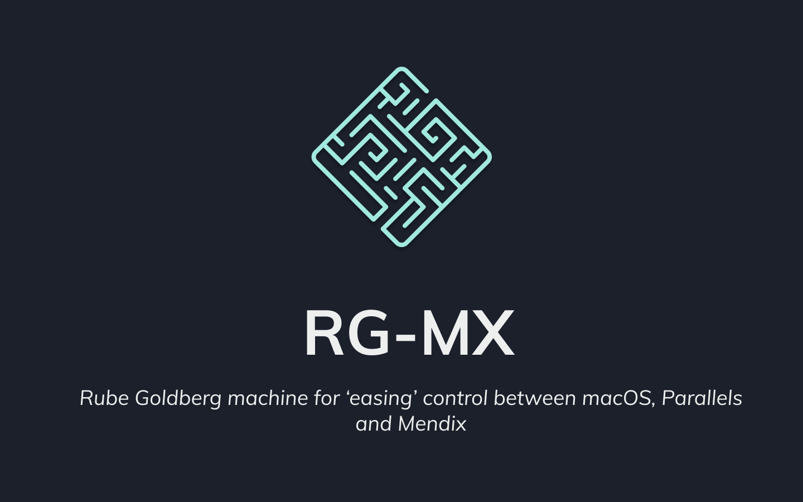

 
      

  
  
  
  
   

<h3>Key Features</h3>

- Open Mendix Projects From Mac
- Open Styles In VS Code or Terminal
- Open Mendix Project in Termianl or CMD
- List all Android Simulators on device
- Install Make it Native 8 or 9
- List All Widgets
- Open Windgets in VS Code or Terminal
- List all GH Users Gists

<h3>The Idea behind RG-MX</h3>

As a Medix Widget Developer, I work and Develop from a Mac, but as Mendix Studio currenlty is only availabile on Windows, I use Parrales as my Windows Client.

This means when I develop Widgets, I am constanly switching Views between mac with Vscode , Windows for Mendix Studio, Broweser for Web View and when I develop Native Windgets the Andriod studio aswell. When Developing I would also have to navigate in the terminal to folders in macOS for Widgets, think `yarn` commands. When building Design Systems for mendix I need to open deep nested folders to find the appropriate sass folders. As a developer who jumps constantly from one project to another I need to open and close multibile projects and on the turn of a dime beable to switch to another. The sulution is either drown in 100's of app windows or use this app.

The idea with this app is just to make thouse every day tasks a bit easier. Within a few clicks I can open a Widget in vscode on my mac, open the appropriate Mendix app on my windows machine and startup my Android simulator with the appropriate Make it Native apps (Mx8 or Mx9). RG-MX will eaven Install the apks.

<h3>How It Works</h3>

You install the app on your windows machine and the app on your macbook.

You point the Windows app to your mendix folders. Copy the Windows Address.

You then go to the mac app and point it to your Mendix Apps Folders. In the Mac app you also add the windows address you added and point it to your widgets folder (if you use it), you also add your github usersname to get all your gists (again only if you use it)

<h4>Setup Setps</h4>
<h5>🛑 Before You Start</h5>

For the App to work you will have some prior setup that need to be done.

- VSCode must be installed and added to your PATH ([macOS](https://code.visualstudio.com/docs/setup/mac#_launching-from-the-command-line)/[Windows](https://code.visualstudio.com/docs/setup/windows#_installation))
- Android Studio must be installed and Configured as Stated by React Native Team ([React Native Setup](https://reactnative.dev/docs/environment-setup#installing-dependencies))
- Parralells must be stup acording to Mendix Docs ([Mendix Docs](https://docs.mendix.com/howto/mobile/using-mendix-studio-pro-on-a-mac))
- All Mendix projects must be in one folder (Nesting is not yet supported [see here](https://github.com/ahwelgemoed/rg-mx/projects/1#card-54876549))
- All Widgets on Mac must be one folder

<h3>Technical Info</h3>

The App is a Electron all, with a Socket IO Server.
Both apps `.dmg` and `.exe` are exactly the same. Open startup in the main proccess, the Operationg system is detected and if its macOS it will Make a "Tray" app and if Windows it will make a "Browser" App. This is why both installs are relativly big, because the Mac app has a socket server that never gets used, and the Windows app has .apks it can never access. This was done to keep the project as simple as possabile. As keeping it all together and separating functionailty based on OS and Routes seemd very easy. It has led to some spagetti code and was more of a headace than expected, I wount recomencd anyone ever do it.
