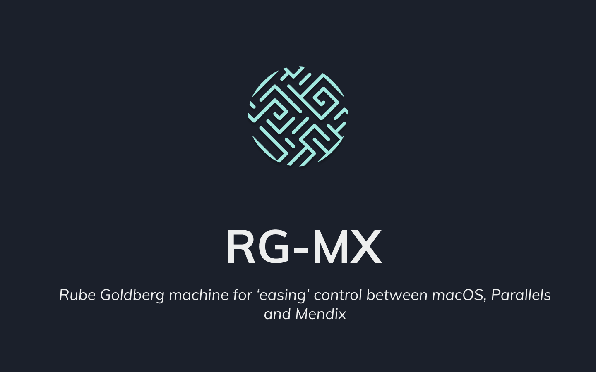

 
      

  
  
  
  
   

<h3>Key Features</h3>

- Install Make it Native 8 or 9 (⚠️ _this is the best feature_)
- Open Mendix Projects From Mac
- Open Styles In VS Code or Terminal
- Open Mendix Project in Terminal or CMD
- List all Android Simulators on device
- List All Widgets
- Open Widgets in VS Code or Terminal
- List all GH Users Gists
     

### 📚 Full Docs [HERE](https://ahwelgemoed.github.io/rg-mx/#/)

   

<h3>The Idea behind RG-MX</h3>

I work and Develop from a Mac, but as Mendix Studio currently is only available on Windows, I use Parallels as my Windows Client.

This means when I develop Widgets, I am switching between mac with VScode, Windows for Mendix Studio, browser for Web View and when I develop Native Widgets the Android studio as well.

When building Designing in Mendix (think `scss`) I need to open deep nested folders to find the appropriate sass folders. As a developer who jumps constantly from one project to another I need to open and close multiple projects a day. This all leads to window-drown, where I have way to many windows open and that hurts my head and performance. I ideally I would like to close all I don't use and only have open only what I am working with.

The idea with the app is to be able to close a project and get back to it with a simple click of a button.

<h3>How It Works (Pointing Hell)</h3>

 Install the app on your windows machine and the app on your Macbook.

You point the Windows app to your Mendix folders and Point the Mac app to that same folder

With the Windows IP you point the Mac app to the Windows App.

This is a Electron app, with a Socket IO Server. Certain commands from the mac is passed to the socket server where the windows app listen and executes them.

Every 30 Seconde the Windows App Pings the Mendix projects to the Mac App.

Every 15 Mins the Windows app looks for more Projects in the Mendix Folder.

<h3>What Makes this App so Good/Bad</h3>

Both apps `.dmg` and `.exe` are exactly the same.

On startup, in the main process, the Operating system is detected and if its macOS it will Make a "Tray" app and if Windows it will make a "Browser" App. This is why both installs are relatively big, because the Mac app has a socket server that never gets used, and the Windows app has `.apks` it can never access. This was done to keep the project as simple as possible, and keeping it all together .Separating functionality based on OS and Routes seemed very easy. It has led to some spaghetti code and was more of a headache than expected, I would not recommend anyone ever do it. 🔥

<h3>Tested On</h3>

- MacOS Big Sur

- Parallels 16

- VMWare Pro 12.1

<h3>FAQ</h3>

Q - "I use alfred, why do I need this?"

A- You don't

<h3>Disclaimer</h3>

This App is Not affiliated with Mendix in anyway and does not carry their approval as 3rd part software.

This is just a helper app used by a Developer 🚀
 
 

<h3>Attributions</h3>

Icons made by <a href="https://www.flaticon.com/authors/zlatko-najdenovski" title="Zlatko Najdenovski">Zlatko Najdenovski</a> from <a href="https://www.flaticon.com/" title="Flaticon">www.flaticon.com</a>

