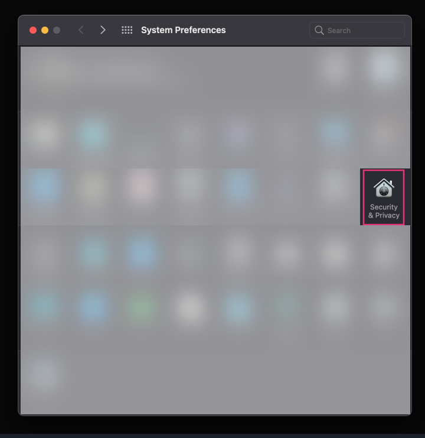
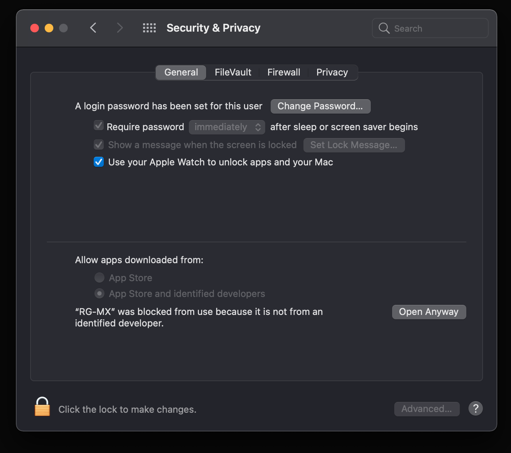

# macOS Guide and Features

**NOTE** Complete the Windows guide first [here](/guide/windowsGuide.md).

## Install

As the app is not signed you will have to manually allow it to run.

1. Download Here

2. Install (Open `.dmg` and drag to Applications)

3. Open the App

4. On your First open you should see something like this:

   

5. Go to System Preferrers and select Security and Privacy

   

6. Under the general Tab click the lock, enter your password and allow the App to run.

   

7. After that the app should open fine.

## On First Startup

_**Note** Finish Windows Setup First for Best results_

On first startup you will be greeted by a Modal Pop up that will look something like this:

Here you have to fille in 2 mandatory information and 2 Optional

1. Windows IP :

Go to the Windows app and click the IP address, that should copy it. Come back to the Mac app and enter it there:

2. Mendix Projects :

As in the Windows setup we need to show the app where you Mendix Apps are. The windows app know where the Mendix apps are relative to Windows. Now we will show the app the path relative to the Windows machine.

3. Widgets Path

If you have a path on the Mac where you keep all your Widgets show it the path and it should add them all there.

4. Github Username

If you want you can add any users github handle in there to see their public gists
